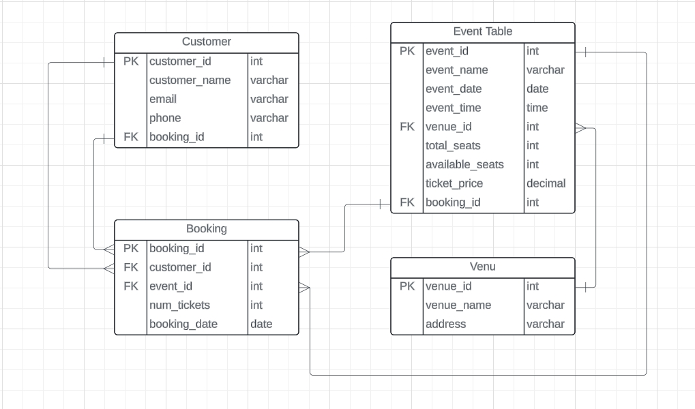

# Hexaware Assignment

## Task 1 : Database Design

1. Create the database named "TicketBookingSystem" 

    ```sql
    CREATE DATABASE TicketBookingSystem;

    USE TicketBookingSystem;
    ```
1. Write SQL scripts to create the mentioned tables with appropriate data types, constraints, and
relationships.
    - Venu
    - Event
    - Customers
    - Booking 
    ```sql
    -- Create the Venu table
    CREATE TABLE Venu (
        venue_id INT PRIMARY KEY,
        venue_name VARCHAR(100) NOT NULL,
        address VARCHAR(255) NOT NULL
    );

    -- Create the Event table
    CREATE TABLE Event (
        event_id INT PRIMARY KEY,
        event_name VARCHAR(100) NOT NULL,
        event_date DATE NOT NULL,
        event_time TIME NOT NULL,
        venue_id INT,
        total_seats INT NOT NULL,
        available_seats INT NOT NULL,
        ticket_price DECIMAL(10, 2) NOT NULL,
        event_type VARCHAR(50) CHECK (event_type IN ('Movie', 'Sports', 'Concert')),
        booking_id INT,
        FOREIGN KEY (venue_id) REFERENCES Venu(venue_id),
        FOREIGN KEY (booking_id) REFERENCES Booking(booking_id)
    );

    -- Create the Customers table
    CREATE TABLE Customers (
        customer_id INT PRIMARY KEY,
        customer_name VARCHAR(100) NOT NULL,
        email VARCHAR(100) NOT NULL,
        phone_number VARCHAR(20) NOT NULL
    );

    -- Create the Booking table
    CREATE TABLE Booking (
        booking_id INT PRIMARY KEY,
        customer_id INT,
        event_id INT,
        num_tickets INT NOT NULL,
        total_cost DECIMAL(10, 2) NOT NULL,
        booking_date DATE NOT NULL,
        FOREIGN KEY (customer_id) REFERENCES Customers(customer_id),
        FOREIGN KEY (event_id) REFERENCES Event(event_id)
    );

    ```
3. Create an ERD (Entity Relationship Diagram) for the database.

4. Create appropriate Primary Key and Foreign Key constraints for referential integrity.
    


## Tasks 2: Select, Where, Between, AND, LIKE:

1. Write a SQL query to insert at least 10 sample records into each table.
```sql
-- Insert sample records into Venu table with short addresses in places around Chennai
INSERT INTO Venu (venue_id, venue_name, address)
VALUES
(101, 'Sathyam Cinemas', 'Royapettah, Chennai'),
(102, 'AGS Cinemas', 'Villivakkam, Chennai'),
(103, 'PVR Cinemas', 'Velachery, Chennai'),
(104, 'Devi Cineplex', 'Mount Road, Chennai'),
(105, 'YMCA Ground', 'Nandanam, Chennai'),
(106, 'Chepauk Stadium', 'Chepauk, Chennai'),
(107, 'Forum Vijaya Mall', 'Vadapalani, Chennai'),
(108, 'Phoenix Market City', 'Velachery, Chennai'),
(109, 'LuxE Cinemas', 'Arcot Road, Vadapalani, Chennai'),
(110, 'Kasi Theatre', 'Jafferkhanpet, Chennai');

-- Insert sample records into Event table with Tamil movie and concert events
INSERT INTO Event (event_id, event_name, event_date, event_time, venue_id, total_seats, available_seats, ticket_price, event_type, booking_id)
VALUES
(201, 'Ghilli - Tamil Movie Screening', '2024-06-15', '18:00', 101, 500, 480, 200.00, 'Movie', 201),
(202, 'Paiyaa - Tamil Movie Screening', '2024-07-20', '17:30', 102, 400, 380, 150.00, 'Movie', 202),
(203, '3 - Tamil Movie Screening', '2024-08-25', '20:00', 103, 600, 580, 250.00, 'Movie', 203),
(204, 'Vijay Antony Live Concert', '2024-09-10', '19:30', 105, 800, 780, 500.00, 'Concert', 204),
(205, 'AR Rahman Live in Chennai', '2024-10-05', '20:00', 105, 1000, 950, 1000.00, 'Concert', 205),
(206, 'Kaber Vasuki Live Concert', '2024-11-15', '21:00', 105, 1200, 1180, 800.00, 'Concert', 206),
(207, 'IPL 2024: Chennai vs. Mumbai', '2024-12-20', '19:30', 106, 15000, 14980, 500.00, 'Sports', 207),
(208, 'IPL 2024: Chennai vs. Kolkata', '2025-01-10', '18:30', 106, 15000, 14950, 500.00, 'Sports', 208),
(209, 'IPL 2024: Chennai vs. Bangalore', '2025-02-15', '20:00', 106, 15000, 14970, 500.00, 'Sports', 209),
(210, 'IPL 2024: Chennai vs. Delhi', '2025-03-20', '19:00', 106, 15000, 14990, 500.00, 'Sports', 210);

-- Insert sample records into Customers table with Indian names
INSERT INTO Customers (customer_id, customer_name, email, phone_number)
VALUES
(301, 'Suresh Kumar', 'suresh@example.com', '987654321'),
(302, 'Malini Seelan', 'malini@example.com', '876543210'),
(303, 'Rajalakshmi Thirumathi', 'rajalakshmi@example.com', '765432109'),
(304, 'Kaviya Raman', 'kaviya@example.com', '654321098'),
(305, 'Karthik Kumar', 'karthik@example.com', '543210987'),
(306, 'Dhanush Sekar', 'dhanush@example.com', '432109876'),
(307, 'Jayalakshmi Sankar', 'jayalakshmi@example.com', '321098765'),
(308, 'Manogar Devar', 'manogar@example.com', '210987654'),
(309, 'Soma Maal', 'soma@example.com', '109876543'),
(310, 'Aruna Kumar', 'aruna@example.com', '098765432');

-- Insert sample records into Booking table with reasonable cost
INSERT INTO Booking (booking_id, customer_id, event_id, num_tickets, total_cost, booking_date)
VALUES
(401, 301, 201, 2, 400.00, '2024-05-01'),
(402, 302, 202, 3, 450.00, '2024-05-02'),
(403, 303, 203, 4, 600.00, '2024-05-03'),
(404, 304, 204, 1, 500.00, '2024-05-04'),
(405, 305, 205, 2, 2000.00, '2024-05-05'),
(406, 306, 206, 3, 1500.00, '2024-05-06'),
(407, 307, 207, 2, 1000.00, '2024-05-07'),
(408, 308, 208, 5, 2500.00, '2024-05-08'),
(409, 309, 209, 3, 750.00, '2024-05-09'),
(410, 310, 210, 4, 2000.00, '2024-05-10')
```
2. Write a SQL query to list all Events.
```sql
SELECT * FROM Event;
```
3. Write a SQL query to select events with available tickets.
```sql
SELECT * FROM Event WHERE available_seats > 0;
```
4. Write a SQL query to select events name partial match with ‘cup’.
```sql
SELECT * FROM Event WHERE event_name LIKE '%cup%';
```
5. Write a SQL query to select events with ticket price range is between 1000 to 2500.
```sql
SELECT * FROM Event WHERE ticket_price BETWEEN 1000 AND 2500;
```
6. Write a SQL query to retrieve events with dates falling within a specific range.
```sql
SELECT * FROM Event WHERE event_date BETWEEN '2024-05-04' AND '2024-05-10';
```
7. Write a SQL query to retrieve events with available tickets that also have "Concert" in their name.
```sql
SELECT * FROM Event WHERE available_seats > 0 AND event_name LIKE '%Concert%';
```
8. Write a SQL query to retrieve users in batches of 5, starting from the 6th user.
```sql
SELECT * FROM Customer ORDER BY customer_id OFFSET 5 ROWS FETCH NEXT 5 ROWS ONLY;
```
9. Write a SQL query to retrieve bookings details contains booked no of ticket more than 4.
```sql
SELECT * FROM Booking WHERE num_tickets > 4;
```
10. Write a SQL query to retrieve customer information whose phone number end with ‘000’
```sql
SELECT * FROM Customer WHERE phone_number LIKE '%000';
```
11. Write a SQL query to retrieve the events in order whose seat capacity more than 15000.
```sql
SELECT * FROM Event WHERE total_seats > 15000 ORDER BY total_seats DESC;
```
12. Write a SQL query to select events name not start with ‘x’, ‘y’, ‘z’
```sql
SELECT * FROM Event WHERE event_name NOT LIKE 'x%' AND event_name NOT LIKE 'y%' AND event_name NOT LIKE 'z%';
```

## Tasks 3: Aggregate functions, Having, Order By, GroupBy and Joins:
1. Write a SQL query to List Events and Their Average Ticket Prices.
```sql 
SELECT event_id, event_name, AVG(ticket_price) AS average_ticket_price
FROM Event
GROUP BY event_id, event_name;
```

2. Write a SQL query to Calculate the Total Revenue Generated by Events.
```sql 
SELECT SUM(num_tickets * ticket_price) AS total_revenue
FROM Booking;
 ```
3. Write a SQL query to find the event with the highest ticket sales.
```sql 
SELECT event_id, event_name, SUM(num_tickets) AS total_tickets_sold
FROM Booking
GROUP BY event_id, event_name
ORDER BY total_tickets_sold DESC
LIMIT 1;
```
4. Write a SQL query to Calculate the Total Number of Tickets Sold for Each Event.
```sql 
SELECT event_id, event_name, SUM(num_tickets) AS total_tickets_sold
FROM Booking
GROUP BY event_id, event_name;
```
5. Write a SQL query to Find Events with No Ticket Sales.
```sql
SELECT *
FROM Event
WHERE event_id NOT IN (SELECT DISTINCT event_id FROM Booking);
 ```
6. Write a SQL query to Find the User Who Has Booked the Most Tickets.
```sql 
SELECT customer_id, COUNT(*) AS total_tickets_booked
FROM Booking
GROUP BY customer_id
ORDER BY total_tickets_booked DESC
LIMIT 1;
```
7. Write a SQL query to List Events and the total number of tickets sold for each month.
```sql 
SELECT MONTH(event_date) AS month, SUM(num_tickets) AS total_tickets_sold
FROM Booking
GROUP BY MONTH(event_date);
```
8. Write a SQL query to calculate the average Ticket Price for Events in Each Venue.
```sql 
SELECT venue_id, AVG(ticket_price) AS average_ticket_price
FROM Event
GROUP BY venue_id;
```
9. Write a SQL query to calculate the total Number of Tickets Sold for Each Event Type.
```sql 
SELECT event_type, SUM(num_tickets) AS total_tickets_sold
FROM Event
JOIN Booking ON Event.event_id = Booking.event_id
GROUP BY event_type;
```
10. Write a SQL query to calculate the total Revenue Generated by Events in Each Year.
```sql 
SELECT YEAR(event_date) AS year, SUM(num_tickets * ticket_price) AS total_revenue
FROM Event
JOIN Booking ON Event.event_id = Booking.event_id
GROUP BY YEAR(event_date);
```
11. Write a SQL query to list users who have booked tickets for multiple events.
```sql 
SELECT customer_id, COUNT(DISTINCT event_id) AS num_events_booked
FROM Booking
GROUP BY customer_id
HAVING COUNT(DISTINCT event_id) > 1;
```
12. Write a SQL query to calculate the Total Revenue Generated by Events for Each User.
```sql 
SELECT customer_id, SUM(num_tickets * ticket_price) AS total_revenue
FROM Booking
GROUP BY customer_id;
```

13. Write a SQL query to calculate the Average Ticket Price for Events in Each Category and Venue.
```sql
SELECT venue_id, event_type, AVG(ticket_price) AS average_ticket_price
FROM Event
GROUP BY venue_id, event_type;
```
14. Write a SQL query to list Users and the Total Number of Tickets They've Purchased in the Last 30
Days.
```sql
SELECT customer_id, COUNT(*) AS total_tickets_purchased
FROM Booking
WHERE booking_date >= DATE_SUB(CURDATE(), INTERVAL 30 DAY)
GROUP BY customer_id;
```

## Tasks 4: Subquery and its types
1. Calculate the Average Ticket Price for Events in Each Venue Using a Subquery.
```sql 
SELECT v.venue_id, v.venue_name,(SELECT AVG(ticket_price) FROM Event WHERE venue_id = v.venue_id) AS avg_ticket_price
FROM Venue v;
```
2. Find Events with More Than 50% of Tickets Sold using subquery.
```sql 
SELECT e.event_name
FROM Event e
WHERE e.total_seats > 0 AND (
    SELECT SUM(b.num_tickets)
    FROM Booking b
    WHERE b.event_id = e.event_id
) > (e.total_seats * 0.5);
```
3. Calculate the Total Number of Tickets Sold for Each Event.
```sql 
SELECT e.event_name, SUM(b.num_tickets) AS total_tickets_sold
FROM Event e JOIN Booking b ON e.event_id = b.event_id
GROUP BY e.event_name;

```
4. Find Users Who Have Not Booked Any Tickets Using a NOT EXISTS Subquery.
```sql 
SELECT c.customer_id, c.customer_name
FROM Customer c
WHERE NOT EXISTS (
    SELECT 1 FROM Booking b
    WHERE b.customer_id = c.customer_id
);

```
5. List Events with No Ticket Sales Using a NOT IN Subquery.
```sql 
SELECT e.event_id, e.event_name
FROM Event e
WHERE e.event_id NOT IN (
    SELECT event_id FROM Booking
);

```
6. Calculate the Total Number of Tickets Sold for Each Event Type Using a Subquery in the FROM
Clause.
```sql 
SELECT e.event_type,
    SUM(ticket_sales.total_tickets_sold) AS total_tickets_sold
FROM Event e
JOIN (
    SELECT event_type, SUM(num_tickets) AS total_tickets_sold
    FROM Event e JOIN Booking b ON e.event_id = b.event_id
    GROUP BY event_type
) AS ticket_sales ON e.event_type = ticket_sales.event_type
GROUP BY e.event_type;

```
7. Find Events with Ticket Prices Higher Than the Average Ticket Price Using a Subquery in the
WHERE Clause.
```sql 
SELECT e.event_id, e.event_name, e.ticket_price
FROM Event e 
WHERE e.ticket_price > (
    SELECT AVG(ticket_price) FROM Event
);

```
8. Calculate the Total Revenue Generated by Events for Each User Using a Correlated Subquery.
```sql 
SELECT c.customer_id, c.customer_name,
    (SELECT SUM(e.ticket_price * b.num_tickets)
    FROM Booking b JOIN Event e ON b.event_id = e.event_id
    WHERE b.customer_id = c.customer_id) AS total_revenue
FROM Customer c;

```
9. List Users Who Have Booked Tickets for Events in a Given Venue Using a Subquery in the WHERE
Clause.
```sql 
SELECT c.customer_name
FROM Customer c 
WHERE EXISTS (
    SELECT 1 FROM Booking b
    JOIN Event e ON b.event_id = e.event_id
    JOIN Venue v ON e.venue_id = v.venue_id
    WHERE b.customer_id = c.customer_id
    AND v.venue_name = 'Venue Name'
);

```
10. Calculate the Total Number of Tickets Sold for Each Event Category Using a Subquery with
GROUP BY.
```sql 
SELECT e.event_type, SUM(ticket_sales.total_tickets_sold) AS total_tickets_sold
FROM Event e 
JOIN (
    SELECT event_type, SUM(num_tickets) AS total_tickets_sold
    FROM Event e JOIN Booking b ON e.event_id = b.event_id
    GROUP BY event_type
) AS ticket_sales ON e.event_type = ticket_sales.event_type
GROUP BY e.event_type;

```
11. Find Users Who Have Booked Tickets for Events in each Month Using a Subquery with
DATE_FORMAT.
```sql 
SELECT customer_id, customer_name, MONTH(booking_date) AS booking_month
FROM Booking
JOIN Customer ON Booking.customer_id = Customer.customer_id
GROUP BY customer_id, customer_name, MONTH(booking_date);

```
12. Calculate the Average Ticket Price for Events in Each Venue Using a Subquery
```sql 
SELECT v.venue_name,
    (SELECT AVG(e.ticket_price)
    FROM Event e WHERE e.venue_id = v.venue_id) AS avg_ticket_price
FROM Venue v;

```